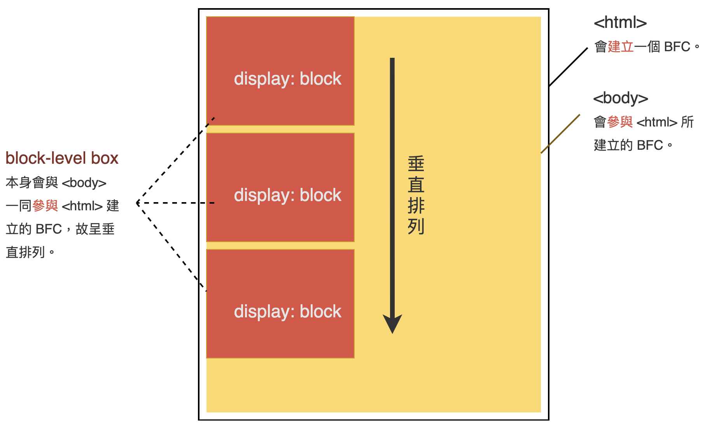
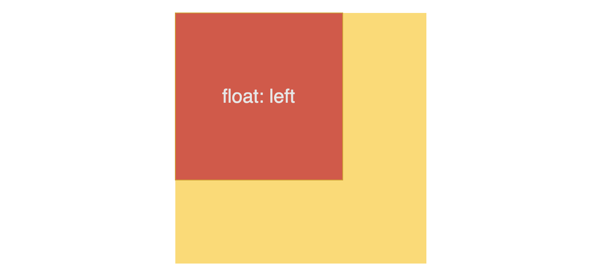
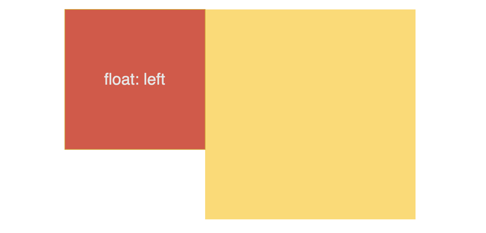

或許你沒聽過 Block Formatting Context，但你肯定有用過！其實在切版時，常常會使用到 BFC，只是你沒有意識到而已，如果能夠有意識的使用 BFC，對於版面的掌控非常有幫助。

<!-- more -->

<br>

## 什麼是 Block Formatting Context

如同上一篇 [CSS 原理 - Formatting Context](https://yachen168.github.io/article/Formatting-context.html#more) 所說，Formatting Context 指的是佈局環境，而佈局環境有許多種，不同的佈局環境會有不同的佈局規則，Block Formatting Context (BFC)是其中一種。

下方為一段 [W3C](https://www.w3.org/TR/CSS21/visuren.html#block-formatting) 對於 BFC 的敘述：
> In a block formatting context, boxes are laid out one after the other, vertically, beginning at the top of a containing block. The vertical distance between two sibling boxes is determined by the 'margin' properties. Vertical margins between adjacent block-level boxes in a block formatting context collapse.

> In a block formatting context, each box's left outer edge touches the left edge of the containing block (for right-to-left formatting, right edges touch).

<br>

簡單來說，處在`同一個 BFC `中的元素(盒子)，會有以下現象：
* 元素(盒子)從其 `containing block(包含塊)`的頂部開始，一個接一個呈現`垂直`排列。

* 若書寫方向為預設的由左至右，則元素(盒子)會貼齊其 containing block(包含塊)左側。

* 相鄰元素(盒子)之間的垂直距離，由元素的 margin 屬性決定。

* 相鄰的 block-level box(塊級盒子)垂直方向會發生 `margin collapsing(邊距重疊)`。

<br>

### 圖示
將上述現象用圖形表示：
```html
<html>
      <body>
            <div></div>
            <div></div>
            <div></div>
      </body>
</html>
```

首先，\<html> 會建立一個 BFC (先破梗了)，而 \<body> 與三個 \<div> 參與的是 \<html> 建立的 BFC，也就是說， \<body> 與三個 \<div> 處於同一個 BFC 中，因此元素會：
- 呈現垂直排列。
- 可以用 margin 來推開彼此。
- 垂直方向會發生 margin collapsing(邊距重疊)，其中 margin collapsing 又分為兩種(同層元素間以及元素與其容器間)，可參考先前文章 [CSS 原理 - Collapsing margins](https://yachen168.github.io/article/Collapsing-margins.html)。




<br>

注意，以上現象強調的是處於同一個 BFC 裡的元素(盒子)，若元素自立門戶創建新的 BFC，則不完全適用，所以`了解什麼情況會建立新的 BFC 很重要`。

<br>
<br>

## 何時會建立 BFC 

對於「什麼時候會建立一個 BFC」，其實 [W3C](https://www.w3.org/TR/css-display-3/#block-formatting-context) 並沒有一個非常正式的定義，有些條件是非常不嚴謹的，而在 [MDN](https://developer.mozilla.org/zh-CN/docs/Web/Guide/CSS/Block_formatting_context) 上則有逐一詳細列出，可供參考。

<br>

根據 [MDN](https://developer.mozilla.org/zh-CN/docs/Web/Guide/CSS/Block_formatting_context)，以下情況的元素會創建 Block Formatting Context(BFC)：
>* \<html>
>* float 元素
>* position: absolute、fixed 的元素
>* overflow: hidden、scroll、auto 的元素
>* display: inline-block 的元素
>* display: flow-root 的元素
>* display: flex 或 inline-flex 元素的`直接子元素`，即 flex items
>* display: grid 或 inline-grid 元素的`直接子元素`，即 grid items
>* display: table、table-caption、table-cell、table-rowtable-row-group、table-header-group、table-footer-groupinline-table
>* contain: layout、content 或 paint 的元素
>* column-count 或 column-width 不為 auto 的元素
>* column-span 為 all 的元素


<br>
<br>

---

## BFC 功用

可以解決：
* `float` 元素的`外層容器塌陷`問題。
* 元素間的 `margin collapsing(外邊距重疊)`問題
* float 元素與其他元素的重疊問題 (float 元素遮住其他元素)。


<br>

### 解決 float 元素造成外容器塌陷問題

float 元素會導致外層容器的高度塌陷(若外層容器高度為 auto 且無其它比 float 元素高的子元素)。

例如：[範例連結](https://codepen.io/yachen/pen/wvambOK?editors=1100)
```html
<div class="container">
    <span>我是裝著 float 元素的容器</span>
    <div class="float">我是 float 元素</div>
</div>
```
```css
.container {
    width: 600px;
    background-color: grey;
    border: 5px solid #333;
}

.float {
    float: left;
    width: 200px;
    height: 150px;
    background-color: yellow;
    border:1px solid black;
    padding: 10px;
}    
```


<br>

此時可以`使外層容器建立 BFC 來恢復高度`，例如在外層容器加上 overflow: hidden 或 display: flow-root。

```css
.container{
      display: flow-root;
}
```

登愣～外層容器撐開了。


<br>

### 解決 margin collapsing 問題
當元素與元素之間發生 margin collapsing 時，可使元素建立 BFC 來解決 margin collapsing 的問題。


<br>

### 解決 float 元素遮住其他元素的問題

在先前文章 [CSS 原理 - Line box](https://yachen168.github.io/article/LineBox.html) 曾提到，float 元素會擠壓 line box，除此之外，float 元素還可能遮住其它元素！
<br>

如果你有用過 float，應該有遇過 float 元素遮住其它非 float 元素的情況，例如：

```html
<div class="float"></div>
<div class="box"></div>
```

```css
.float{
      float: left;
      width: 200px;
      height: 200px;
      background-color: orange;
}

.box{
      display: block;
      width: 300px;
      height: 300px;
      background-color: yellow;
}
```

橘色的 float 元素蓋住了黃色元素。



<br>

只要讓黃色元素建立 BFC 即可解決重疊問題，例如加上 overflow: hidden 或 display: flow-root。


```css
.box{
      display: flow-root;
}
```



<br>
<br>
<br>

<b>參考資源</b>

[W3C-Appendix A: Glossary](https://www.w3.org/TR/css-display-3/#glossary)
[W3C-Box Layout Modes: the display property](https://www.w3.org/TR/css-display-3/#the-display-properties)
[W3C-Collapsing margins](https://www.w3.org/TR/CSS21/box.html#collapsing-margins)
[MDN-Block formatting context](https://developer.mozilla.org/en-US/docs/Web/Guide/CSS/Block_formatting_context)

