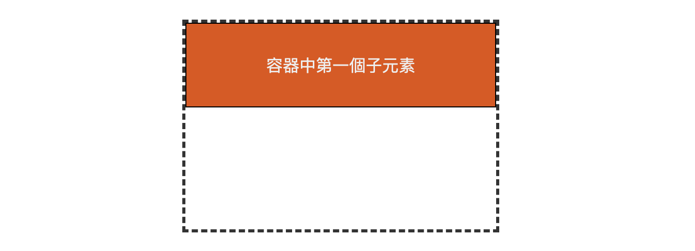
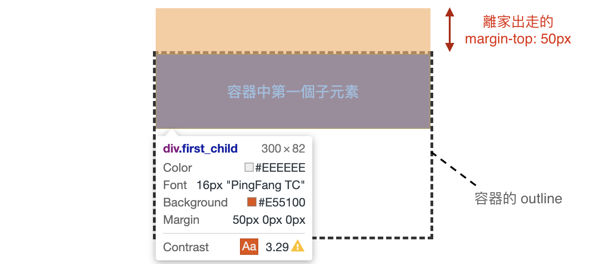

## 什麼是 Collapsing margins？

先來看一段 [W3C 規範](https://www.w3.org/TR/CSS2/box.html#collapsing-margins) 的敘述：
> In CSS, the adjoining margins of two or more boxes (which might or might not be siblings) can combine to form a single margin. Margins that combine this way are said to collapse, and the resulting combined margin is called a collapsed margin.

<!-- more -->

簡單來說，當相鄰(adjoining)的 margin 相遇時，若合併成一個 margin，這種情況稱為 Collapsing margins。其中，[W3C](https://www.w3.org/TR/CSS2/box.html#collapsing-margins) 對於`相鄰(adjoining)`的定義為：

* 僅發生於`垂直方向`
<br>

* 皆為在文檔流中(in flow)的塊級元素(block-level)元素，且參與`同一個`[塊格式化上下文(block formatting context，BFC)](https://developer.mozilla.org/zh-CN/docs/Web/Guide/CSS/Block_formatting_context)。
  
  例如，若是元素會創建新的 BFC，像是根元素 \<html> 、float、position: absolute......等等，該元素就不會有 margin collapsing，至於什麼情況下會創建新的 BFC，可參考 [MDN-block formatting context](https://developer.mozilla.org/zh-CN/docs/Web/Guide/CSS/Block_formatting_context)。

<br></br>

## 什麼時候會發生 margin collapsing？
margin collapsing 可分為兩種情況，一種是同層元素之間，另一種是元素與其父(母)容器之間，但並非所有 block-level 元素皆會發生 margin collapsing，而是有前提條件的。

### (一) 相鄰的兄弟姊妹
>  同層且相鄰的 block 元素的 margin-bottom 與 margin-top 相遇時，發生重疊，僅發生於垂直方向。

<b>前提條件：</b>
block 須符合相鄰(adjoining)的定義：
* 皆為在文檔流中(in flow)的塊級元素(block-level)元素，且參與同一個[塊格式化上下文(BFC)](https://developer.mozilla.org/zh-CN/docs/Web/Guide/CSS/Block_formatting_context)。


例如：兩個相鄰的 block 元素，紅色 block 的 margin-bottom = 30px，黑色 block 的 margin-top = 30px，最終兩個 block 元素之間的距離為 30px，而非 60px。
<br></br>

[範例連結](https://codepen.io/yachen/pen/xxKmZrd?editors=1100)
```html
<div class="block1">我有 margin-bottom：30px</div>
<div class="block2">我有 margin-top：30px</div>
```

```css
.block1 {
  margin-bottom: 30px;
  background-color: red;
}

.block2 {
  margin-bottom: 30px;
  background-color: black;
}
  
```


<br></br>

### (二) 容器與其第一個/最後一個子元素
> 亦僅發生於垂直方向，且有其前提條件。

<b>前提條件:</b> 

* 皆為在文檔流中(in flow)的塊級元素(block-level)元素，且參與同一個[塊格式化上下文(BFC)](https://developer.mozilla.org/zh-CN/docs/Web/Guide/CSS/Block_formatting_context)。
<br>

* 容器`無`設定`邊框(border)`、`內距(padding)`或加上 `clear-fix` 的屬性。


<br></br>

例如：

虛線為容器的 outline，紅色區塊為容器內的第一個子元素，現在子元素頂部緊貼著容器頂部。若想利用 margin-top 屬性，讓子元素的頂部距離容器頂部 50px。
結果會發現，子元素的頂部並沒有與容器頂部分離！

[範例連結](https://codepen.io/yachen/pen/ZEzVGRx)
```html
<div class="container">
    <div class="first_child">容器中的第一個子元素</div>
</div>
```

```css
.first_child {
    margin-top: 50px;
}
```


<br></br>

打開開發人員工具檢視一下，會發現子元素的 margin-top 竟然跑出容器外了，這`結果與直接在父容器上設定 margin-top: 50px 是一樣的`。

<br></br>



<br></br>

## 解決方法：
使其不再符合前提條件，例如不再是 block 或是創建 BFC。


<br></br>

## margin 計算方式
當發生 margin collapsing 時，由於外距(margin)可為負數，故會有三種情況：

* 兩個 margin 皆為正 ⇒ 取大值

* 一個 margin 為正，一個 margin 為負 ⇒ 相加

* 兩個 margin 皆為負 ⇒ 取最小 (最負)


<br></br>


參考資料
1. [W3C - Collapsing Margins](https://www.w3.org/TR/CSS2/box.html#collapsing-margins)
2. [W3C - Box Model](https://www.w3.org/TR/css-box-3/)
3. [MDN - Mastering margin collapsing](https://developer.mozilla.org/en-US/docs/Web/CSS/CSS_Box_Model/Mastering_margin_collapsing)
4. [MDN - Block formatting context](https://developer.mozilla.org/zh-CN/docs/Web/Guide/CSS/Block_formatting_context)