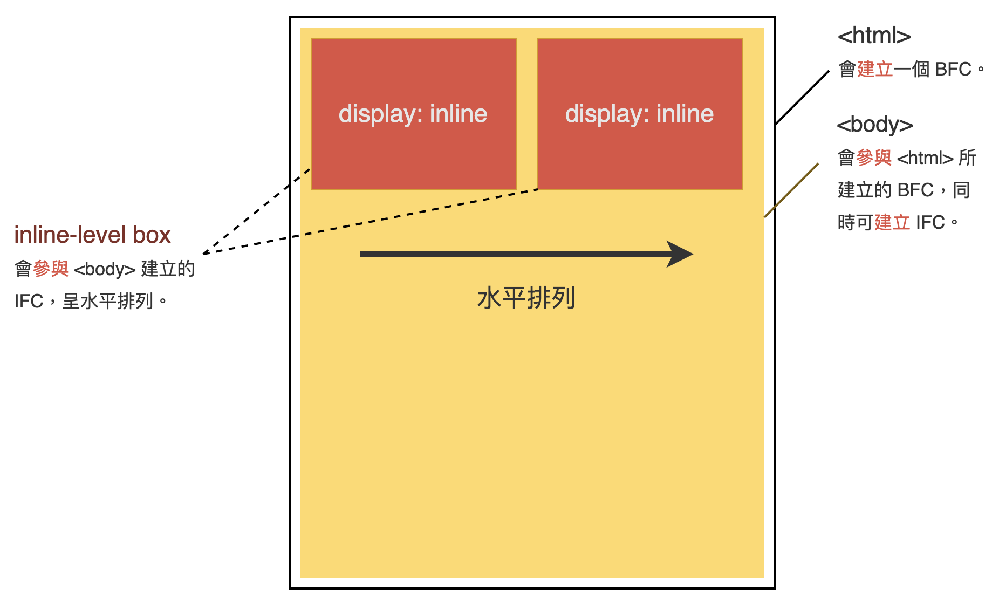

每個元素都是一個個的盒子(box)，這些盒子在 in flow 下會如何排列就要看該盒子處在什麼樣的佈局環境，而 formatting context (格式化上下文) 指的就是佈局環境，不同類型的佈局環境會有不同的佈局規則，換句話說，處在不同類型佈局環境裡的盒子，排列方式會有所不同。

<!-- more -->

## 什麼是 Formatting Context
先來看一段 W3C 規範對於 formatting context (格式化上下文) 的敘述。
摘自 [W3C](https://www.w3.org/TR/css-display-3/#glossary)
> A formatting context is the environment into which a set of related boxes are laid out. Different formatting contexts lay out their boxes according to different rules.

> A box either establishes a new independent formatting context or continues the formatting context of its containing block. The type of formatting context established by the box is determined by its inner display type.

> Additionally, some types of formatting contexts interleave and co-exist.

 

也就是說，formatting context 指的是一個「佈局環境」，處在什麼佈局環境裡的元素(盒子)，就得遵守什麼環境的佈局規則，盒子也可以自立門戶，建立新的 formatting context，再繼續裝其它盒子，而會`建立什麼類型的 formatting context`，取決於 display 屬性的 `inner display type`。可參考先前文章 [你所不知道的 display](https://yachen168.github.io/article/display.html)。

有些類型的 formatting contexts 可以同時交互並存，像是 BFC 與 IFC 或是 FFC 與 IFC 等。
 

## Formatting Context 類型
Formatting context 大致有以下幾種，其中，BFC 與 IFC 對於排版來說最為重要，而除了 BFC 較為特殊之外，其餘的 formatting context 取決於元素的 display 屬性。

- Block Formatting Context (BFC)
- Inline Formatting Context (IFC)
- Flex Formatting Context (FFC)
- Grid Formatting Context (GFC)
- Ruby Formatting Contect (RFC)

 

## Independent Formatting Context

剛提到盒子可以自立門戶，為其後裔元素`建立`自己的 formatting context，而當一個元素(盒子)建立了獨立的 formatting context，不論所建立的類型是否與該元素所處的 formatting context 相同，都是為其`後裔元素`建立了一個新的佈局環境，所以其後裔元素的佈局通常不必再遵守該元素所處的佈局環境規則。

值得留意的是，除了 display 之外，有些屬性也會使元素`建立`獨立的 formatting context，像是 `float`、`position: absolute` 或 `fixed` 這些會使元素脫離正常流(out-of-flow)的屬性皆會`建立`獨立的 formatting context。

 

## 圖解 Formatting Context
「Formatting context 是個佈局環境，不同的 formatting context 有不同的佈局方式」，用圖形或許可以幫助理解，以下將舉三個例子，主要為 BFC 與 IFC，其他類型的 formatting context 概念皆相同，可以此類推。

下圖截取部分 W3C 規範中的 display 表格，若對於這個表格感到陌生的讀者，建議先看先前文章 [你所不知道的 display](https://yachen168.github.io/article/display.html)。

圖片來源: [W3C](https://www.w3.org/TR/css-display-3/#the-display-properties)

 

### Case1: BFC
\<html> 就是個超級大盒子，裡面裝著其他盒子，且會`建立`一個 BFC，由上方 display 表可知，其後裔元素 \<body> 與三個橘色的 block 元素皆會生成 block-level box，且處在 BFC 裡(或說是`參與` BFC)，所以會呈現垂直排列。

 

### Case2: IFC
由上方 display 表可知，\<body> 對內會生成 block container，可以建立 IFC，而其兩個橘色的 inline 後裔元素會生成 inline box(為一種 inline-level box)，且處在此 IFC 中(或說是`參與`該 IFC)，所以呈現水平排列。

 

### Case3: 混合
inline-block 元素會生成`inline-level box`，該元素本身處在 \<body> 所建立的 IFC 中(或說是`參與`該 IFC)，且兩個 inline-block 元素分別為其後裔元素建立了新的獨立佈局環境──`BFC` 與 `IFC`，所以其後裔元素`不會`與 inline-block 元素一同參與外部 IFC。

 
 

## 結語
說穿了，formatting context 就真的只是「佈局環境」而已，花了一個篇幅解釋 formatting context 其實是在替後面的文章鋪路，接下來將介紹在排版中最為重要的 block formatting context(BFC)。

 
 
 

<b>參考資料</b>
[W3C - Appendix A: Glossary](https://www.w3.org/TR/css-display-3/#glossary)
[W3C - Box Layout Modes: the display property](https://www.w3.org/TR/css-display-3/#the-display-properties)
[W3C - Block-level elements and block boxes](https://www.w3.org/TR/CSS2/visuren.html#block-boxes)
[W3C - Inline-level elements and inline boxes](https://www.w3.org/TR/CSS2/visuren.html#inline-boxes)

