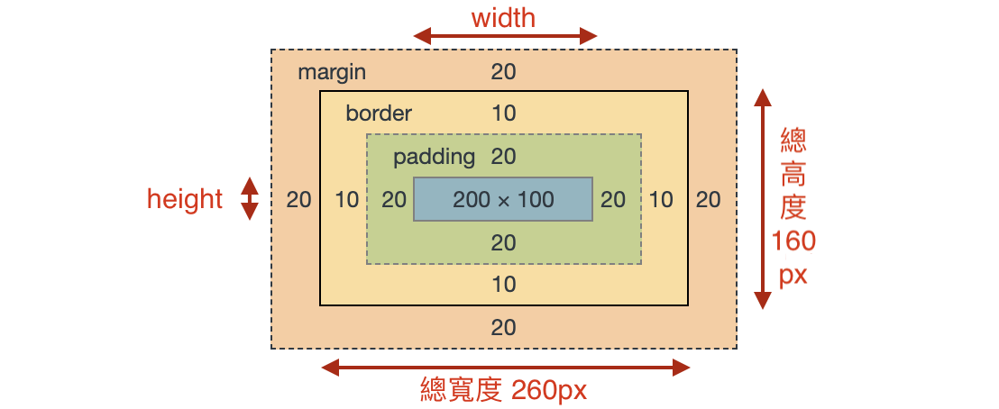
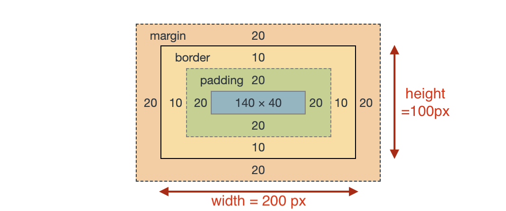

想像每個元素都是個盒子，而 \<html> 就像是個超級大盒子，裡面裝了許許多多大小不一的盒子，像是 \<div>、\<p>、\<span>、\<button>......等等，而每個盒子由四個部分組成。

<!-- more -->

如下圖所示，box model 由四個部分組成，由內至外依序為
- content area (內容區)
- padding (內距)
- border (邊框)
- margin (外距)


## content area
內容區域，也就是盒子裡裝的東西，可能是文字、圖片或是又裝了其它元素(其他盒子)，例如 \<div>、\<p>、\<span>、\<button>......等等。

<br>
<br>

## padding (內距)

可想像成盒子和其內容物的距離，介於 content area(內容區) 與 border(邊框)之間的部分。其特色為

- 厚度取決於 padding 屬性，

- 不能為負值。

- 預設下，padding 不包含在屬性 width 的範圍，因 box-sizing 預設值為 content-box，當然只包含最裡面的 content 部分。 


<br>
<br>


## border (邊框)

介於 margin (外距)與 padding(內距) 之間的範圍。

* 可以使用 border 屬性來設置邊框的寬度、樣式與顏色。
  三合一縮寫語法 (三個值的順序可以互換)：
  ```css
  border: border-width｜border-style｜border-color
  ```

  亦可單獨指 定border 的寬度、樣式與顏色。個別屬性如下：
    * border-width (邊框寬度)
    * border-style (邊框樣式)
    * border-color (邊框顏色)
<br>
* 預設情況下，不包含在 width 與 height 的範圍內。

<br>
<br>

## margin (外距)
margin 圍繞於 border 之外，用於推開元素與其它元素之間的距離。其特色為

- 厚度取決於 margin 屬性。

- 可以是正值或負值，但若為負值，可能會與其它元素重疊。

- 元素本身的背景設定無法渲染至 margin 部分，例如 background-color 或 background-image。

- 不包含在 width 與 height 範圍內。


<br>
<br>
<br>

## box-sizing
一個新手常遇見的問題：奇怪，明明指定了元素的 width 與 height，但元素渲染於畫面上的寬度與高度卻比自己設定的值來得大？

這問題通常與 box-sizing 有關。

box-sizing 屬性決定如何計算一個元素渲染於畫面上的總寬度與總高度，也就是 size，有 content-box 與 border-box 兩種屬性值。


<br>

### (一) content-box
```css
box-sizing: content-box；
```
content-box 為預設值，如同字面上的意思，若該元素可以指定 width 與 height，則在設定 width 或 height 時，其指定的僅為最內層的 content 部分，例如 width: 100px，則代表元素的 content area 寬度為 100px。

如果同時還設定了 padding 或是 border，則必須再加上 padding 與 border，才是最終渲染於畫面上的寬度或高度。
  

<br>

例如： 給定一個 div 的設定如下：
[codepen 範例連結](https://codepen.io/yachen/pen/oNvQpgG?editors=1100)
```css
div {
    box-sizing: content-box; /*預設值*/
    width: 200px;
    height: 100px;
    padding: 20px;
    margin: 30px;
    border: 10px solid black;
}
```

則在 `content-box` 下：<br>
最終渲染寬度 ≠ width 200px<br>
而是 ( width 200 + 左右 padding 20\*2 + 左右 border 10\*2 )px = 260px ;<br>

最終渲染高度 ≠ height 100px<br>
而是( height 100 + 上下 padding 20\*2 + 上下 border 10\*2 )px = 160px。




<br>
<br>


### (二) border-box

```css
box-sizing: border-box;
```
如同字面上的意思，若該元素可以指定 width 與 height，則 width 和 height 屬性值涵蓋的範圍為 border 以內，也就是 content、padding 和 border，注意，不包括 margin。

border-box 可以使元素渲染於畫面上的總寬度與總高度的計算變得較直覺簡單，不必再額外加上 padding 和 border，連 bootstrap 也對所有元素做了此設定。
    
<br>

例如： 給定一個 div 的設定如下：
在 `border-box` 下：<br>
最終渲染寬度即為 width 200px ;<br>
最終渲染高度即為 height 100px。

```css
div {
    box-sizing: border-box;
    width: 200px;
    height: 100px;
    padding: 20px;
    margin: 30px;
    border: 10px solid black;
}
```


<br>
<br>
<br>
<br>


參考資料
1. [W3C - CSS Box Model Module Level 3](https://www.w3.org/TR/css-box-3/) 
2. [MDN - The box model](https://developer.mozilla.org/zh-CN/docs/Learn/CSS/Building_blocks/The_box_model)
3. [MDN - box-sizing](https://developer.mozilla.org/zh-CN/docs/Web/CSS/box-sizing)
