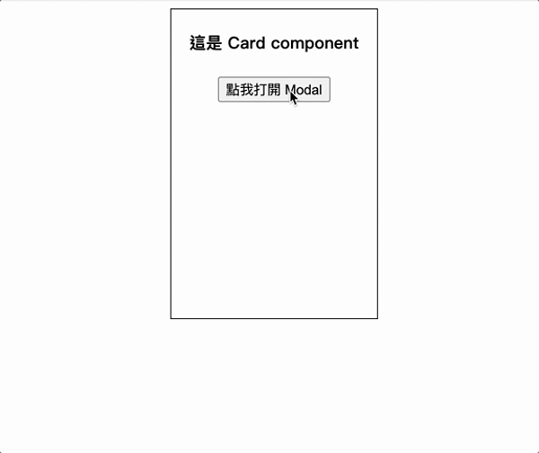
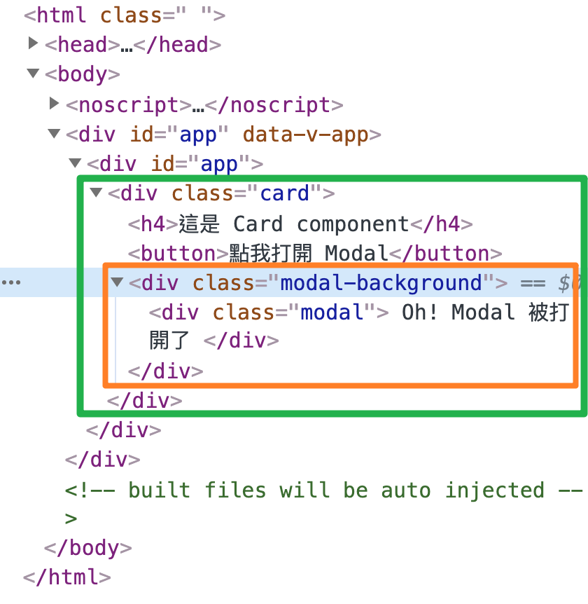
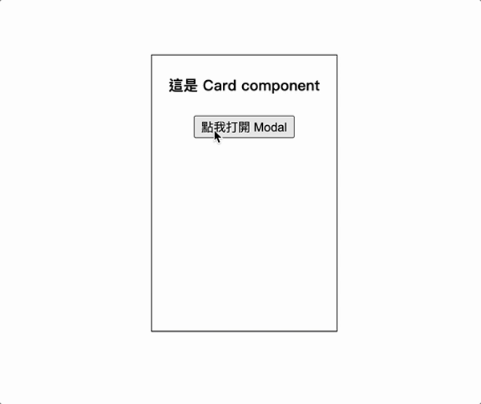
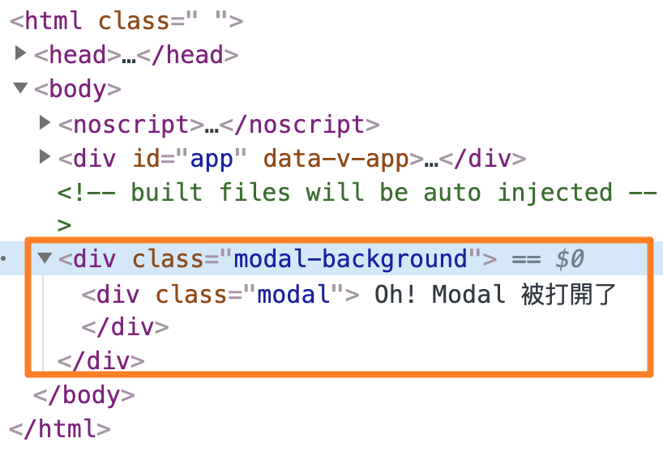
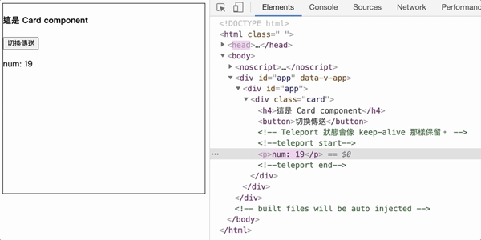

Vue3 Composition API 新增了 Teleport 功能，讓我們可以輕鬆的將組件傳送到指定的地方，很酷的是，它還能夠保存狀態!

<!-- more -->

## 為什麼需要 Teleport？
最常見的情境是彈跳視窗，在開發時，我們會希望把彈跳視窗的開關邏輯封裝在 component 裡面，而不是裸露在頁面上。以程式碼來說，就是將控制開關的變數 `isModalOpen: false(true)` 設置在 component 裡。

一個極端的例子是：有 6 張 HTML 和 CSS 樣式皆相同的 Cards，但裡面的資料不同，點擊這 6 張 Cards，會分別跳出各自的彈跳視窗，而 6 個彈跳視窗的 HTML 和 CSS 樣式皆相同，但裡面的資料不同。

在這樣的情境下，應該沒有人想要在頁面上設定 6 個變數，分別控制這 6 個彈跳視窗吧!

較好的作法是將彈跳視窗開關的邏輯封裝在 Card component 中，然後在頁面上用 `v-for` 產生 6 張 Card，這時每張 Card 裡控制彈跳視窗開關的變數 `isModalOpen` 都是獨立的，不會互相干擾。

但是這樣的方式其實會有隱患，因為一般來說會將彈跳視窗用 `position: fixed` 固定在視窗(viewport)，在大多數情況下，彈跳視窗會如我們所願的針對視窗做定位，但仔細看 [MDN](https://developer.mozilla.org/zh-CN/docs/Web/CSS/position) 上對於 `position: fixed` 的定義：


圖片來源: [MDN-position](https://developer.mozilla.org/zh-CN/docs/Web/CSS/position)

簡單來說，若彈跳視窗(position: fixed)的祖譜鏈中有一個祖先元素設定了 transform、perspective 或 filter 屬性時，那麼彈跳視窗將不再以視窗(viewport) 做定位，而是以該祖先元素做定位，那麼彈跳視窗就會壞掉！

有了 `Teleport`，就可以開閃現，讓彈跳視窗在 DOM tree 中瞬移到 body 節點(整個 \<app> 外)的尾部，如此一來我們就可以安心的把開關的邏輯封裝在 Card 中，因為不管是 Card 或是 Card 外層元素使用了 transform、perspective 或 filter，都不再關彈跳視窗的事了，因為這時彈跳視窗的祖先元素就是 \<body> → \<html> → viewport。這樣還有另一個好處是，不用再微調 z-index 了，因為彈跳視窗被傳送到 \<app> 後方(\<body> 尾部)。


## Teleport 語法
在 Vue 的 \<template> 中可以直接使用 \<Teleport>，無需特別引入。

\<Teleport> 有兩個屬性：
- to: 用 query selector 指定要傳送到哪裡，也可以使用動態指定` :to`。
```html
<teleport to="#some-id" /> 
<teleport to=".some-class" />
<teleport to="body" />
<teleport to="[data-teleport]" />
```
- disabled: 決定是不是要傳送出去。
  - false: 傳出去(預設)。
  - true: 不要傳出去，將 \<Teleport> 裡的東西留在原本的地方

<br>

### 範例

#### 使用 Teleport 前

現在有 Card 與 Modal 組件，點擊 Card 裡面的按鈕，會打開彈跳視窗(Modal)，Modal 以 position: fixed 固定在視窗(viewport)。

在 Card 中引入 Modal 組件，並且把控制 Modal 開關的邏輯封裝在 Card 中。這時的畫面是可以正常運行的。

[程式碼範例](https://stackblitz.com/edit/vue3-teleport?file=src%2Fcomponents%2FCard.vue)

在 Card.vue 中:
```html
<template>
  <div class="card">
    <h4>這是 Card component</h4>
    <button @click="isModalOpen = true">確認送出訂單</button>

    <Modal v-if="isModalOpen" />
  </div>
</template>
```
```javascript
<script>
import { ref } from 'vue';
import Modal from './Modal.vue';

export default {
  name: 'Card',
  components: {
    Modal
  },
  setup() {
    const isModalOpen = ref(false);  // 控制 Modal 開關

    return {
      isModalOpen
    }
  }
}
</script>
```
```css
<style scoped>
  .card {
    width: 200px;
    height: 300px;
    margin: 0 auto;
    border: 1px solid #000;
    text-align: center;
  }
</style>
```

在 Modal.vue 中:
```html
<template>
  <div class="modal-background">
    <div class="modal">
    	OH! Modal 被打開了
    </div>
  </div>
</template>
```
```javascript
<script>
export default {
  name: 'Modal'
}
</script>
```
```css
<style scoped>
  .modal-background {
    display: flex;
    justify-content: center;
    align-items: center;
    position: fixed;
    background: rgba(0, 0, 0, 0.3);
    width: 100%;
    height: 100vh;
    top: 0;
    left: 0;
  }

  .modal {
    width: 200px;
    height: 100px;
    padding: 20px 0;
    border-radius: 5px;
    background: #eee;
    text-align: center;
  }
</style>
```

效果如下



打開開發者工具檢視一下 DOM 結構，可以看到在尚未使用 \<Teleport> 之前，Modal 是長在 Card 裡面。



如剛剛所說，這樣的問題是，只要上層元素中有一個設定了 transform、perspective 或 filter，那麼 Modal 將不再針對視窗做定位，且有時可能會需要微調 z-index。

證明方式很簡單，可以在 Card 的 style 中加入 `transform: translateY(20%)` 來做測試。[程式碼範例](https://stackblitz.com/edit/vue3-teleport?file=src%2Fcomponents%2FCard.vue)

```css
<style scoped>
  .card {
    width: 200px;
    height: 300px;
    margin: 0 auto;
    border: 1px solid #000;
    text-align: center;
    /* 在 Modal 的祖先元素 Card 中加上 transform */
    transform: translateY(20%);   
  }
</style>
```
會發現 Modal 壞掉了，因為這時 Modal 將以 Card 做定位，而非視窗。



#### 使用 Teleport 後

現在使用 \<Teleport>，將 Modal 瞬移到 body 節點的尾部。[程式碼範例](https://stackblitz.com/edit/vue3-teleport?file=src%2Fcomponents%2FCard.vue)

```html
<template>
  <div class="card">
    <h4>這是 Card component</h4>
    <button @click="isModalOpen = true">點我打開 Modal</button>

    <-- 使用 Teleport 將 Modal 傳送到 body 尾部 -->
    <Teleport to="body" v-if="isModalOpen">
      <Modal />
    </Teleport>
  </div>
</template>
```
```javascript
<script>
import { ref } from 'vue';
import Modal from './Modal.vue';

export default {
  name: 'Card',
  components: {
    Modal
  },
  setup() {
    const isModalOpen = ref(false);

    return {
      isModalOpen
    }
  }
}
</script>
```
```css
<style scoped>
  .card {
    width: 200px;
    height: 300px;
    margin: 0 auto;
    border: 1px solid #000;
    text-align: center;
    /* card 不再是 Modal 的祖先元素，所以再也無法影響 Modal */
    transform: translateY(20%);
  }
</style>
```

再次打開開發者工具檢視，可以看到 Modal 出現在 body 內的尾部(在 <app> 之後)，如此以來，即使在 Card 的 style 中設定了 transform、perspective 或 filter，Modal 皆不會受到影響，也不會有煩人的 z-index 問題。



<br>

## Teleport 特性 - 保留狀態
`Teleport` 還有一個特別之處是：裡面的狀態會被保存，就像是 \<keep-alive> 那樣，不會被 destroyed(或 unmounted)。

### 範例

利用 \<Teleport> 的 `disabled` 屬性來證明：

首先讓 `isNumTeleport` 預設值為 `true`(表示 Teleport 內的東西不會被傳送出去)，當點擊按鈕時，就會 toggle `isNumTeleport` 變數，使 \<Teleport> 內東西可以在 \<Card> 與 \<body> 之間來回穿梭。

而 \<Teleport> 內為 `num`，每 1 秒會增加 1。

[範例程式碼](https://stackblitz.com/edit/vue3-teleport-3bqzmz?file=src%2Fcomponents%2FCard.vue)

```html
<template>
  <div class="card">
    <h4>這是 Card component</h4>
    <button @click="toggleNumTeleport">傳送</button>

    /* Teleport 狀態會像 keep-alive 那樣保留。 */
    <Teleport to="body" :disabled="isNumTeleport">
        <p>num: {{ num }}</p>
    </Teleport>
  </div>
</template>
```
```javascript
<script>
import { ref, onMounted } from 'vue';

export default {
  name: 'Card',
  setup(){
    const num = ref(0); 
    const isNumTeleport = ref(true);

    onMounted(() => {
      setInterval(() => {
        num.value++;
      }, 1000);
    });

    const toggleNumTeleport = () => {
      isNumTeleport.value = !isNumTeleport.value;
    }

    return {
      num,
      isNumTeleport,
      toggleNumTeleport
    }
  }
}
</script>
```
```css
<style scoped>
  .card {
    height: 370px;
    border: 1px solid #000;
  }
</style>
```
實現效果如下，可以清楚看到，無論怎麼切換，\<Teleport> 裡面的狀態都會被保留(num 不會重頭計算)。



<br>

Facebook 和 Youtube 的縮小影片功能，感覺就很適合用 Teleport 實現呢XD
<br>


<br>

## 結論
使用 \<Teleport> 將彈跳視窗傳送到 \<body> 尾部(\<app> 後方)的好處是可以避開 CSS 中 fixed 定位的雷，也不用再調 z-index 了，讓開發者可以安心地的把邏輯封裝在 component 裡面。

\<Teleport> 除了瞬移之外，還有保留狀態的特性，所以總覺得 \<Teleport> 還可以拿來應用在其它有趣的地方，但是暫時想不到其它案例哈，如果讀者有遇到其它適合使用 \<Teleport> 的情境，歡迎留言告訴我XD

<br>
<br>

<b>參考資料</b>
1. [Vue3 文件 - Teleport](https://v3.vuejs.org/guide/teleport.html#using-with-vue-components)
2. [MDN - position](https://developer.mozilla.org/zh-CN/docs/Web/CSS/position)
