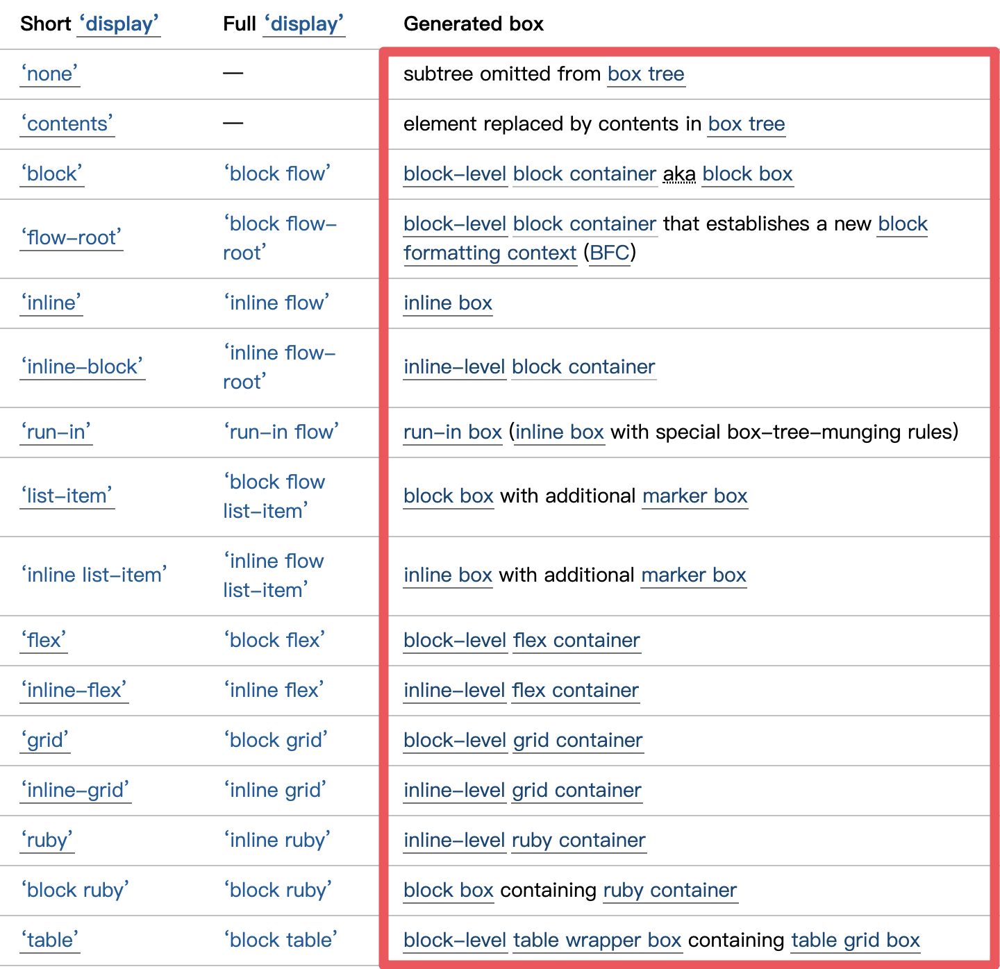

Visual formatting model (視覺格式化模型) 對於排版來說是很重要的觀念，但不是那麼平易近人且有點抽象，在初次看 [W3C 規範](https://www.w3.org/TR/CSS2/visuren.html) 時一定是霧煞煞，強烈建議先釐清幾個重要名詞的定義，會發現繞來繞去，講的其實都是相同的概念。

<!-- more -->

## display

為什麼 display: block 的元素們會呈現垂直排列？為什麼 display: inline 的元素們會呈現水平排列？又為什麼 display: inline-block 的元素是呈現水平排列呢？其實答案都與元素生成(generate)何種類型的 box 有關。 
 

在先前 [box model 文章](https://yachen168.github.io/article/box-model.html)中曾介紹，元素就像一個個的盒子 (box)，這篇將介紹在 in flow 下，這些「 盒子如何排列」，或說是「`元素如何佈局`」。

元素在 in flow 下如何佈局的主要關鍵為該元素「生成 (generate)了什麼類型的 box」，而這會取決於元素的 `display 屬性`。其實我們所熟悉的 display 同時定義了元素的兩種 display type：

- <strong>outer display type</strong>：決定元素「`本身`」在 in flow 下如何佈局，即元素本身`參與`的是何種 formatting context (格式化上下文)。
 

- <strong>inner display type</strong>：決定元素為它的後裔元素`建立`何種 formatting context，與其`後裔元素的佈局`有關。
 

### outer display type

在 outer display type 方面，box 類型可分成 `inline-level box` 與 `block-level box` 兩大類，所有 inline-level box 皆會`參與 IFC`，呈現`水平`排列，而所有 block-level box 皆會`參與 BFC`，呈現`垂直`排列。

- <strong>inline-level box (行內級盒子)</strong>
    * inline box (行內盒子)

    * atomic inline-level box (原子行內級盒)
 

- <strong>block-level box (塊級盒子)</strong>
 

### inner display type
在 inner display type 方面，因其描述的是元素本身與其內容或後裔元素的關係，可以想像成元素像個容器 (container)，裝著文字內容或後裔元素。常見的 container box 類型有 block container box、flex container box 與 grid container box 等等。

而什麼類型的 container box，就會為其內容或後裔元素`建立`什麼類型的 formatting context，例如：

- flex container 建立 flex formatting context (FFC)

- grid container 建立 grid formatting context (GFC)
- block container 可建立 block formatting context (BFC) 或 inline formatting context (IFC)

順帶一提，替換元素 (replaced element)，例如 \，display 的預設值為 inline，不論將其 display 屬性值改成什麼，皆不會有 container box，因為它就是路徑來源的圖片，不是用來裝像是 \、\
 或其他元素的容器。

圖片來源: [W3C](https://www.w3.org/TR/css-display-3/#the-display-properties)

 
 

## 了解 display 的好處

講了這麼多，了解 display 到底有什麼好處？
個人認為至少有三大優點。

### 秒殺元素排列方式
即使遇到一個從來沒用過的 display 屬性值，也能夠馬上知道在 in flow 下，元素會`如何排列`，例如，你有聽過或用過 display: flow-root 或 inline-flex 嗎？

在沒有用過，甚至從沒聽過的情況下，一看 display 表就可以得知 display: flow-root 的元素會生成 block-level box，故元素本身參與 BFC，在 in flow 下會呈現垂直排列。而 display: inline-flex 會生成 inline-level box，故元素本身參與 IFC，在 in flow 下會呈現水平排列。
 

### 秒殺屬性的適用對象
例如常用的 vertical-align 與 text-align 對齊，你知道他們能操控的對象總共有哪些嗎？
其實他們是在操控 `inline-level` 的垂直與水平對齊。

vertical-align 屬性可以適用於所有 inline-level boxes，也就是可以操控 display 表上所有會生成 inline-level box 元素的垂直對齊。

圖片來源：[W3C](https://www.w3.org/TR/css-inline-3/#propdef-vertical-align)

而 text-align 的屬性則是須設定在 inline-level 外層的 block container，它可操控 display 表上所有會生成 inline-level box 元素的水平對齊。

圖片來源：[W3C](https://www.w3.org/TR/css-text-3/#justification)

 

再例如，margin: 0 auto，常用在 display: block 元素的水平置中，但除此之外，還可以用在哪些元素上呢？

其實 display 表上會生成 block-level box 的皆適用。
 

### 何種 display 會產生 BFC
就如同剛剛提及的，什麼類型的 container box 就會`建立`什麼類型的 formatting context，所以 block container box 可以建立 BFC，這時就可以由 dispaly 表中得知 display: inline-block 與 flow-root 皆會建立 BFC (display: block 例外)。

另外，其實 display: table 與 inline-table 亦會建立 BFC，因生成的 [table wrapper box](https://drafts.csswg.org/css-tables-3/#table-wrapper-box) 也是一種 block container。

block formatting context (BFC) 在排版中是非常重要的一環，這部分的介紹留在之後文章再詳細說明。

 
 
 
 

參考資源
1. [W3C-Controlling box generation](https://www.w3.org/TR/CSS22/visuren.html)
2. [W3C-Appendix A: Glossary](https://www.w3.org/TR/css-display-3/#glossary)
3. [W3C-Box Layout Modes: the display property](https://www.w3.org/TR/css-display-3/#the-display-properties)

