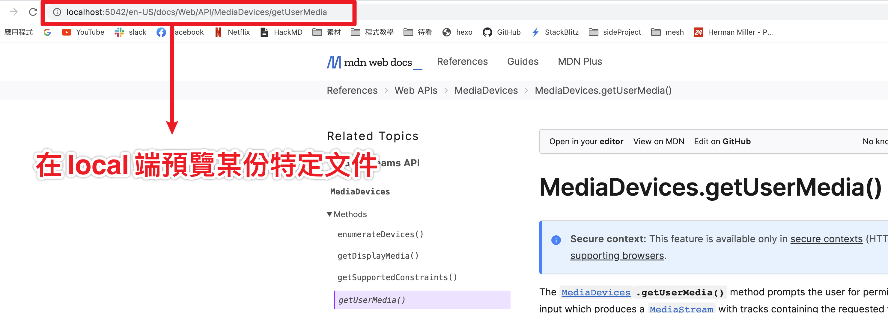
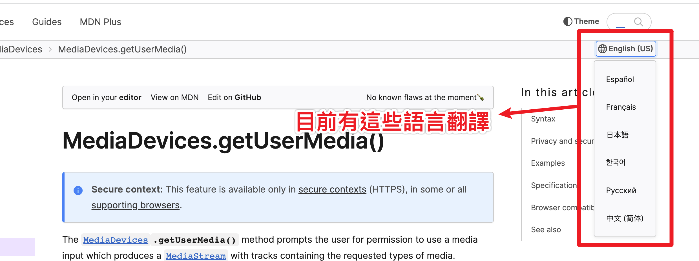
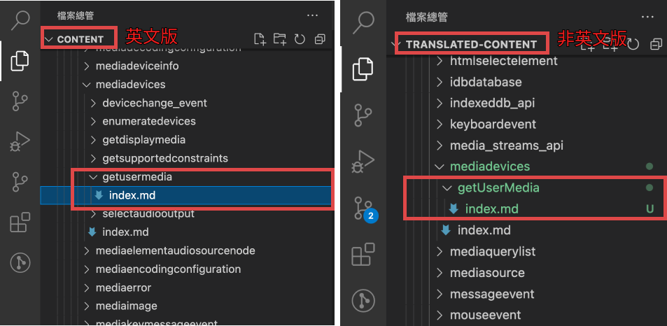
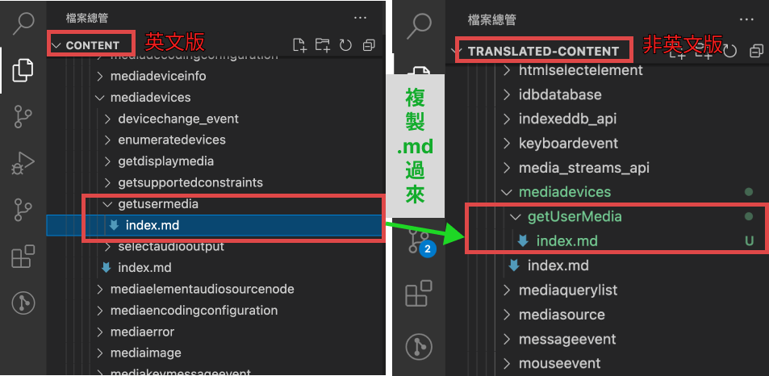
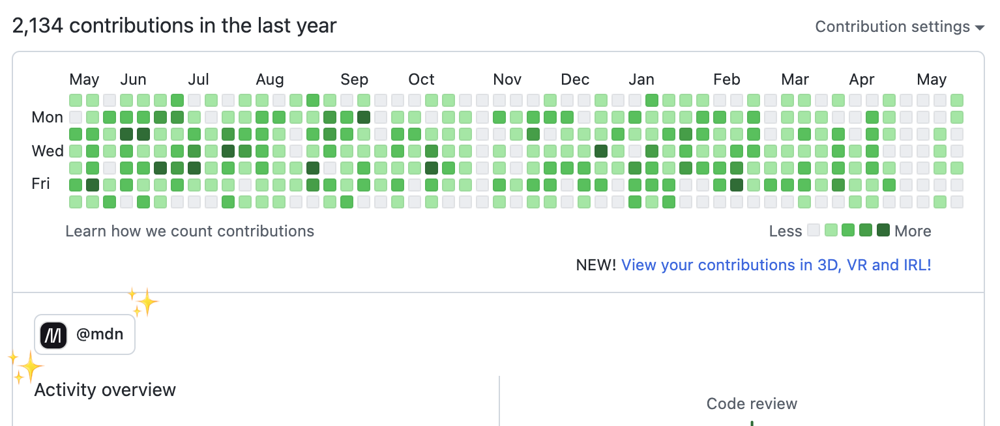

身為一個工程師，查找 MDN 應該是家常便飯，如果想對 MDN 文件內容進行勘誤或是幫忙更新文件，可以參考一下這篇文章XD

故事是這樣的...某天在查找 MDN docs 時，突然注意到最底下這個區塊(以前都視而不見)...那天滑鼠不知為何就這樣點了進去，然後突然覺得發現新大陸🐒，加上原本正打算好好的看一下某個主題的 MDN API docs，於是就興起了一邊看 MDN docs 一邊幫忙翻譯的衝動。後來發 PR 也意外的順利通過，決定來整理一下重點和注意事項給有興趣跳坑的人做參考。

<!-- more -->

<br/>


整個過程大致可分為四個步驟:
一、fork & clone MDN 的 repo
二、詳細閱讀格式規範和注意事項
三、進行一些設置，在 local 即時預覽正在編輯的 MDN 頁面
四、編輯 & 發送 PR

接下來會針對以上四個步驟進一步說明

<br/>

## 一、Fork & Clone repo
MDN 的文件內容分為以下二個 repo，如果要編輯英文版文件，fork [content repo](https://github.com/mdn/content) 即可; 如果想要編輯「`非`」英文版的 MDN 文件， 則以下==二個 repo 都要 fork== :
   1. [content](https://github.com/mdn/content)：這個 repo 只存放英文版的文件內容
   2. [translated-content](https://github.com/mdn/translated-content)：這個 repo 存放所有「非」英文版的文件內容

fork 完成後，再從自己的 Github 把 fork 來的 repo clone 下來。

<br/>


## 二、閱讀格式規範和注意事項
在開始編輯之前，務必先看過 repo 說明，確認自己的編輯有符合規範後再發送 PR，減少審核人員的負擔。

**以下整理幾個大重點:**

1. 英文版最大！所有的翻譯都是向英文版看齊，所以請直接拿英文版(content 資料夾)的 .html 或 .md 檔案內容的進行翻譯，因為其他語言(translated-content 資料夾)的內容不一定是最新的。

2. 在 content 和 translated-content 下的 `/files` 資料夾中，可能會看到夾雜著 .html 或 .md 的檔案，MDN 團隊計畫慢慢將 .html(舊) 更新成 .md(新)，所以如果要翻譯的話建議可直接使用 .md 檔。

3. 可以看到在 content 和 translated-content 下的 `/files` 資料夾中，還有巢狀的資料夾，在 translated-content 編輯時，如果需要新增 .html 或是 .md 檔案(可能之前沒人翻譯過，你是 NO.1)，須確認巢狀結構、資料夾名稱以及檔案名稱和 content 資料夾的一致。

4. 參考格式規範：[MDN guidelines](https://developer.mozilla.org/en-US/docs/MDN/Guidelines)、[Writing style guide](https://developer.mozilla.org/en-US/docs/MDN/Guidelines/Writing_style_guide)、[guide to writing Markdown for MDN](https://developer.mozilla.org/en-US/docs/MDN/Contribute/Markdown_in_MDN)

5. 需注意有些語言可能會有額外的格式規範，例如以「繁體中文」來說，可以在 translated-content 資料夾的 `/docs/zh-tw/translation-guide.md` 看到針對繁體中文格式的額外規範說明，像是標點符號、空白修飾、術語等等。

6. 務必自己另開一個新的 branch 來進行編輯，不要在 main branch 進行任何修改。

7. 注意 git commit 的拆分以及 commit message。


📌 更多細節請詳見 [content](https://github.com/mdn/content) 和 [translated-content](https://github.com/mdn/translated-content)

<br/>

## 三、設置 & 預覽編輯畫面
📍 content 資料夾 👉 在 local 端跑起來可預覽編輯的 MDN 頁面(也可以預覽 translated-content 資料夾的東西，很酷!🧞‍♂️)
📍 translated-content 資料夾 👉 在這個資料夾可編輯「非」英文版本的 MDN 文件內容

**clone 之後，先打開 ==content==，接著進行下設定:**
1. 讓 git 也連到 mdn/content 的 repo，之後就可以在 local 端 pull mdn/content 的最新內容，執行:
```shell=
git remote add mdn git@github.com:mdn/content.git
```
2. 確認有添加成功，執行:
```shell=
git remote -v
```


3. 建立自己的 branch:
```shell=
git branch your-branch-name
```
4. 切換到自己的 branch:
```shell=
git checkout your-branch-name
```
5. 在 content 目錄下添加 .env 檔案，.env 檔案裡放上 `EDITOR` 和 `CONTENT_TRANSLATED_ROOT` ，CONTENT_TRANSLATED_ROOT 後面放路徑，指向 translated-content 下的 files 資料夾:
**❗️ 如果只想編輯英文版的文件，沒有要在本地端預覽其他語言的文件，則不需要 CONTENT_TRANSLATED_ROOT**
```
EDITOR = code;
CONTENT_TRANSLATED_ROOT=/Users/yachen/Desktop/translated-content/files 👉 不要複製貼上，這個是我的路徑，記得改成你自己的
```

6. 執行 `yarn start`，之後可以在 local 端(local:5042)預覽編輯頁面，稍後在步驟四會進一步說明
```shell=
yarn start
```


<br/>

## 四、編輯 & 發送 PR
首先在編輯器打開 content 和 translated-content ，並且完成步驟二的設定，確定 `yarn start` 已經成功執行。
在編輯時，一定會想要即時預覽編輯的畫面，以下分享我的小撇步~
直接舉例子來做說明，假設「我想翻譯 `getUserMedia` 的繁體中文文件」：

1. 可直接打開 google 搜尋「getUserMedia mdn」，就可找到這份[線上的文件](https://developer.mozilla.org/en-US/docs/Web/API/MediaDevices/getUserMedia)，接著複製 domain url 後方的路由 `/en-US/docs/Web/API/MediaDevices/getUserMedia`。==注意這個巢狀路由，和巢狀的資料夾結構是一樣的，可以利用它快速找到某個文件檔案==。


<br/>

2. 然後貼到 local:5042 後方，也就是 `http://localhost:5042/en-US/docs/Web/API/MediaDevices/getUserMedia`，就可以在 local 端即時預覽英文版的 getUserMedia API 文件的編輯畫面。


<br/>

3. 可以從下拉選單切換不同語言，同時可快速看出這份文件目前有哪些語言翻譯 (可以看出這份文件目前還沒有人翻成繁體中文)


<br/>

4. 從 3. 下拉選單切換語言的動作可看出只要將 /`en-US`/docs/Web/API/MediaDevices/getUserMedia 的 `en-US` 改成其他語言，例如: ja(日文) 或 ko(韓文)，就可以切換到其他語言的 getUserMedia 文件(如果該語言有人翻譯這份文件的話)


<br/>

5. 從 3. 也可以看出，目前 getUserMedia API 沒有繁體中文的文件，所以如果「我想幫忙翻譯成繁體中文(zh-tw)」的話，就需要在 translated-content 資料夾下的 `/files/zh-tw/web/api/mediaDevices/getUserMedia` 建立一個 index.md 檔案。如果是第一個翻譯的人，就會需要自己建立相關的資料夾和 .md 檔案，注意！==在 translated-content 所新增的資料夾/檔案結構和名稱都要和英文版(content 資料夾)的一樣!==


<br/>

6. 完成了 5. 之後，到英文版的 content 資料夾的 `/files/en-US/web/api/mediaDevices/getUserMedia` 的 .md 檔案，直接複製並貼到 translated-content 裡相同位置的 .md 檔案，就可以在 local 端看到語言切換的下拉選單，多出了「繁體中文」的選項！點擊切換到繁體中文！



<br/>

7. 開始進行編輯，可以即時預覽畫面


<br/>


8. 編輯完成後，push 到自己的 github，並發送 PR，等待該語系的審核人員審查。


<br/>


## 結語
第一次在大型的開源專案發 PR，也意外的順利，覺得開心哈哈

在過程中也發現，MDN docs 的繁體中文資源相對少很多，雖然說看英文版才能獲得第一手最新的資訊，但還是希望繁體中文的勢力可以日益壯大XD

以這次的經驗來說，總結了以下五大收穫(優點)：
1. 看了自己想看的某部分 MDN API docs，獲得相關知識
2. 在翻譯的過程中，加深自己對於 docs 內容的印象 (怕被退件 & 翻錯誤人子弟所以看得更仔細)
3. 可以順便練英文
4. 體驗大型開源專案的 PR 流程
5. 讓閱讀 MDN docs 的人們可以多一個語言切換的選擇

是不是助人助己~ 好處多多~😆      ~(缺點:需要時間XD)~

<br/>

最後還有一個 bonus! 就是 Github 個人頁面上會出現一個閃亮亮的酷東西😍，趕緊入坑吧各位！



<br/>
<br/>
<br/>

<b>參考資源:</b>
1. [Content of MDN Web Docs](https://github.com/mdn/content)
2. [Translated content of MDN Web Docs](https://github.com/mdn/translated-content)


