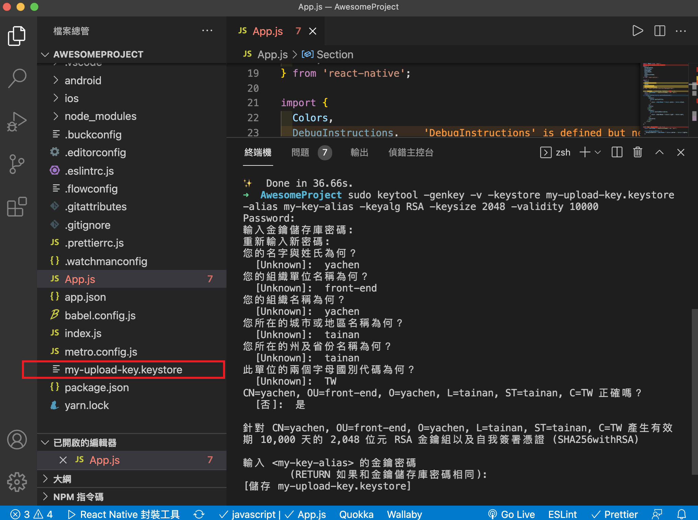
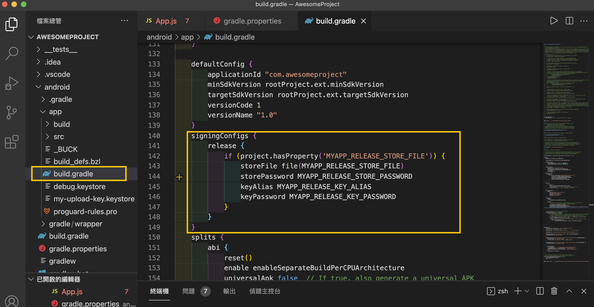
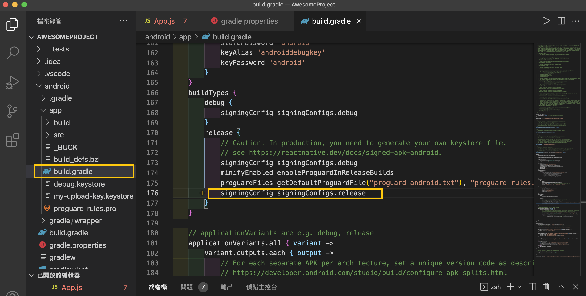
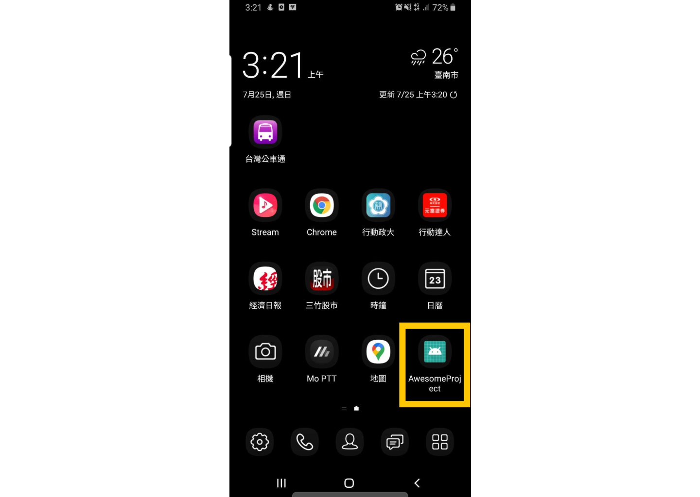

這系列文章將一步步介紹如何在 mac 上搭建 Android 和 ios 的開發環境(React Native ClI)、如何在模擬器和實體裝置中運行、如何打包 AAB(APK) 和 IPA。

而這篇將介紹如何<b>將你的 RN 專案打包成 AAB(APK)！</b>，如果你還沒建置好 Android 的開發環境，請先跟著:
- [React Native 開發環境建置 - Android 篇(上)](https://yachen168.github.io/article/rn-environment-android.html#more)
- [React Native 開發環境建置 - Android 篇(下)](https://yachen168.github.io/article/rn-hello-world.html#more)
  
的步驟設定 Android 開發環境和建立 RN 專案。

<!-- more -->

<br/>

# 生成簽名密鑰
首先，用 VSCode 打開你的 RN 專案，在專案的根目錄下，執行以下指令:
```shell
sudo keytool -genkey -v -keystore my-upload-key.keystore -alias my-key-alias -keyalg RSA -keysize 2048 -validity 10000
```

上方指令中的 `my-upload-key.keystore` 可以任意改成 xxxx.keystore
上方指令中的 `my-key-alias` 可以任意改成 xxxx，但<b>`請務必記得你設定的 alias!`</b>

接著需要填寫一些設定:
- 輸入金鑰儲存庫密碼: yachen168 (自行設定，`必須記住!`)
- 再次輸入新密碼: yachen168
- 您的名字與姓氏為何: yachen (自行設定)
- 您的組織單位名稱為何: front-end (自行設定)
- 您的組織名稱為何: yachen    (自行設定)
- 您所在的城市或地區名稱為何: tainan    (自行設定)
- 您所在的州及省份名稱為何: tainan   (自行設定)
- 此單位的兩個字母國別代碼為何: TW   (自行設定)
- CN=yachen, OU=front-end, O=yachen, L=tainan, ST=tainan, C=TW 正確嗎？: 是

- 輸入 <my-key-alias> 的金鑰密碼 (如果要和金鑰儲存庫密碼相同 👉 直接按 Enter) : 按 enter 或另外設定密碼(`必須記住!`)

完成上述動作後，會看到專案下多了一個 `xxxx.keystore` 的檔案:



<br/>

## 設置 Gradle variables
1. 將剛剛生成的 `xxxx.keystore` 檔案移到專案中的 android/app 資料夾下:


2. 在 ~/.gradle/gradle.properties(全域，將套用到所有專案) 或你的 RN 專案中的 `android/gradle.properties` 加上 (<b>下方 4 個等號後面改成你剛剛填寫的設定</b>):

```shell
MYAPP_UPLOAD_STORE_FILE=my-upload-key.keystore
MYAPP_UPLOAD_KEY_ALIAS=my-key-alias
MYAPP_UPLOAD_STORE_PASSWORD=你設定的密碼
MYAPP_UPLOAD_KEY_PASSWORD=你設定的密碼

```


## 將簽名配置加到專案中的 Gradle config
在專案下的 android/app/build.gradle 中添加以下配置(參考下圖):

```shell
android {
    ...
    defaultConfig { ... }
    signingConfigs {
        release {
            if (project.hasProperty('MYAPP_RELEASE_STORE_FILE')) {
                storeFile file(MYAPP_RELEASE_STORE_FILE)
                storePassword MYAPP_RELEASE_STORE_PASSWORD
                keyAlias MYAPP_RELEASE_KEY_ALIAS
                keyPassword MYAPP_RELEASE_KEY_PASSWORD
            }
        }
    }
    buildTypes {
        release {
            ...
            signingConfig signingConfigs.release
        }
    }
}
```




<br/>

# 生成 ABB
cd 進到 RN 專案的 android 資料夾中，然後執行 `./gradlew bundleRelease` 打包 `ABB`:

```shell
cd android
./gradlew bundleRelease
```
生成的 `ABB` 檔案會在 `android/app/build/outputs/bundle/release` 中，之後可以上架到 Google Play 商店。

</br>

# 生成 APK
如果你還不想上架到 Google Play 商店，只是想直接傳給親朋好友做測試，那可以選擇打包 `APK`:
```shell
cd android
./gradlew assembleRelease
```
生成的 `APK` 檔案會在 `android/app/build/outputs/apk/release` 中，將 `app-release.apk` 的檔案傳給朋友，朋友直接在手機上下載安裝後就可以使用你的 app 了！



打開 APP:


<br/>

# 結語
這篇文章主要目的為「如何打包 ABB(APK)」，因筆者目前自學 RN 還不到 1 個禮拜，所以有關於 APK 效能的一些進階設定，選擇先略過 ><，有興趣的讀者可以先參考 [RN 文件](https://reactnative.dev/docs/signed-apk-android) 上較詳細的說明。如果文章中有描述不正確的地方，也歡迎留言指正 😆。

最後，如果在打包過程中有發生任何 error，請先耐心的回頭檢查 Android 開發環境、keystore 是否有正確設置，任何一個小環節沒設置好都可能發生問題!

Android 篇就暫時告一段落了，接下來將進入 ios 囉!

<br/>
<br/>

<b>參考資源</b>
1. [RN Docs - signed-apk-android](https://reactnative.dev/docs/signed-apk-android)
2. [Android developer - app-signing](https://developer.android.com/studio/publish/app-signing)
3. [React Native 開發環境建置 - Android 篇(上)](https://yachen168.github.io/article/rn-environment-android.html#more)
4. [React Native 開發環境建置 - Android 篇(下)](https://yachen168.github.io/article/rn-hello-world.html#more)
  