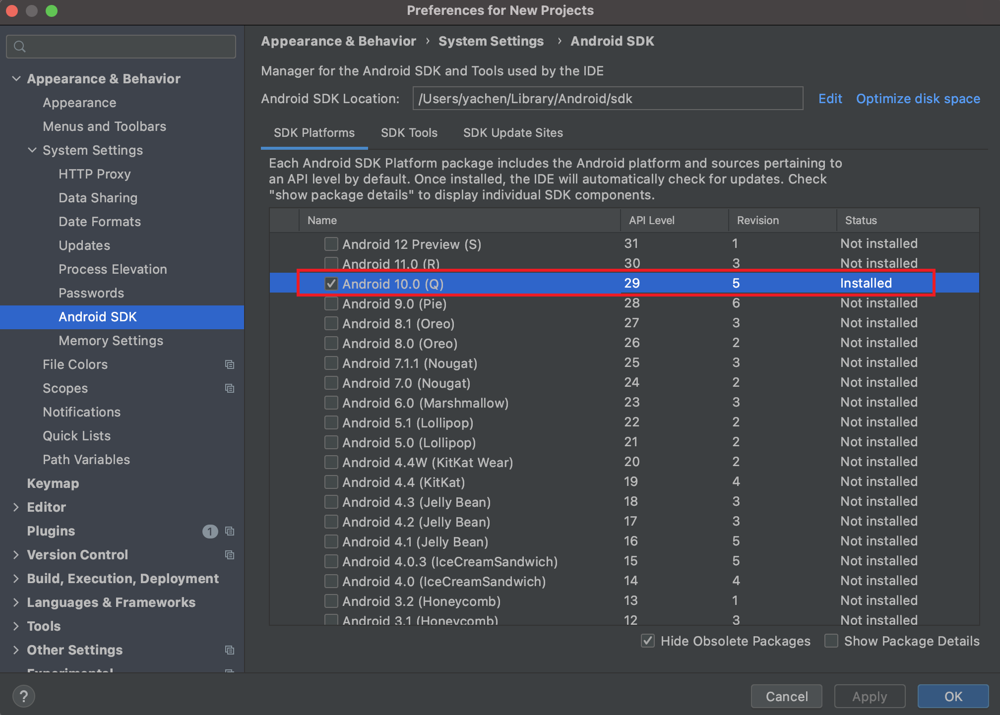
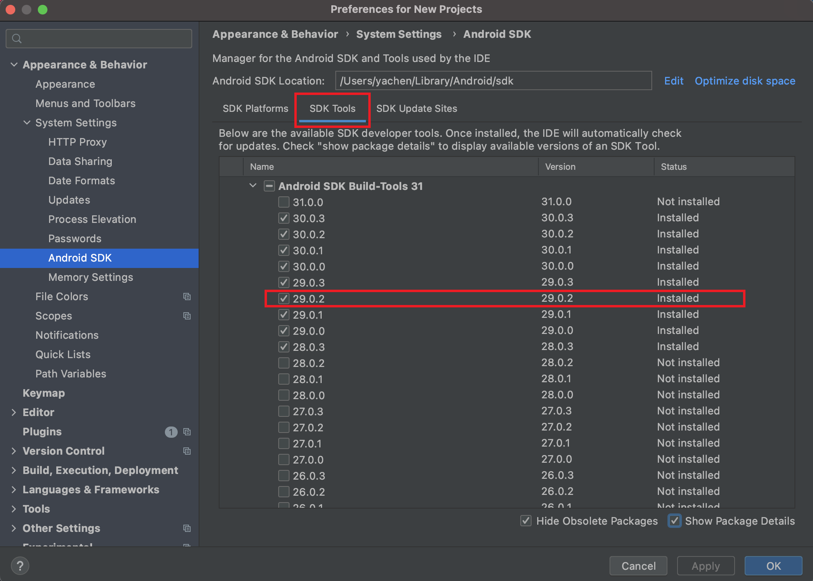
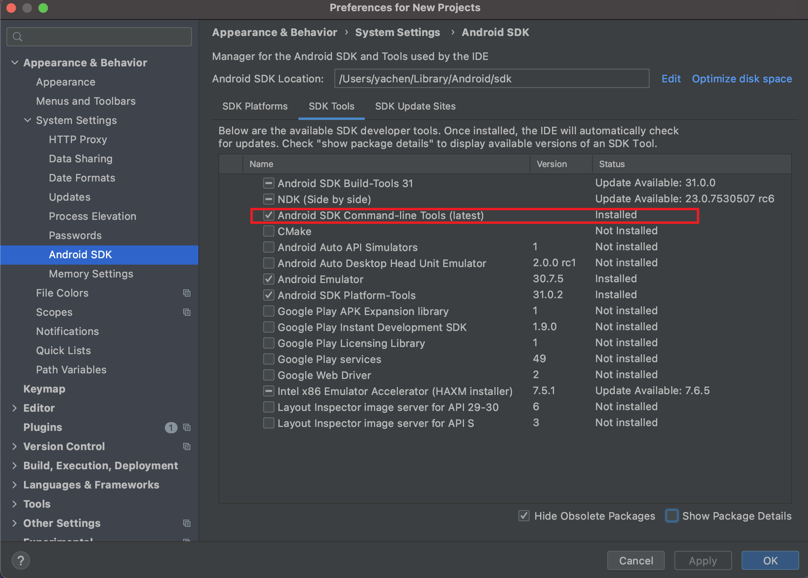

這系列文章將一步步介紹如何在 mac 上搭建 Android 和 ios 的開發環境(React Native ClI)、如何在模擬器和實體裝置中運行、如何打包 APK 和 IPA。因為筆者覺得 ios 比較複(機)雜(車)，所以會先從 Android 開始介紹。

會選擇 React Native ClI 而不是較友善的 Expo ClL 是因為筆者之後想要在 RN 上用 WebRTC，考慮到支援度的問題，所以選擇 React Native ClI。

<!-- more -->

<br/>

# 安裝 dependencies
在建置 Android 開發環境之前，需要先安裝的 dependencies 有：
- Node
- Watchman
- JDK (Java Development Kit)
- Android Studio

<br/>

## Node & Watchman & JDK
使用 `Homebrew` 安裝 Node、Watchman、JDK：
```shell
brew install node
brew install watchman
brew install --cask adoptopenjdk/openjdk/adoptopenjdk8
```
如果你以前就安裝過 Node，請確保 Node 版本為 12 以上。
如果你以前就安裝過 JDK，請確保 JDK 版本為 8 以上。

<br/>

# 建置 Android 開發環境
## 安裝 Android Studio
安裝完 Node、Watchman 和 JDK 後，就可以開始建置 Android 的開發環境了！
[下載並安裝 Android Studio](https://developer.android.com/studio)，需注意的是，在安裝 Android Studio 時，記得要將以下三個勾選起來：
- Android SDK
- Android SDK Platform
- Android Virtual Device

<br/>

## 安裝 Android SDK
Android Studio 預設會安裝最新版的 SDK，而 React Native 需要的是 `Android 10 (Q)` 版本的 SDK，可以在 Android Studio 中的 `SDK Manager` 選擇 SDK 版本。

可以在 Android Studio menu 中的 `Preferences` → `Appearance & Behavior` → `System Settings` → `Android SDK` 找到:


勾選 `Android 10 (Q)`:



接著繼續在 `SDK Platform` 的 tab 下，勾選右下角的 `Show Package Details`，確認在 Android 10 (Q) 下有勾選：
- Android SDK Platform 29
- Intel x86 Atom_64 System Image 或 Google APIs Intel x86 Atom System Image


在 `SDK Tools` 的 tab 中，勾選右下方的 `Show Package Details`，確認 `Android SDK Build-Tools` 下的 `29.0.2` 有被勾選起來:



將 `Android SDK Command-line Tools (latest)` 勾選起來:



最後按下 `Apply` 開始下載並安裝以上的設定!!!

<br/>

## 配置 ANDROID_HOME 的環境變量
打開終端機，在 $HOME/.bash_profile 或 $HOME/.bashrc (如果你是使用 zsh 則為 ~/.zprofile 或 ~/.zshrc) 添加：

```shell
export ANDROID_HOME=$HOME/Library/Android/sdk
export PATH=$PATH:$ANDROID_HOME/emulator
export PATH=$PATH:$ANDROID_HOME/tools
export PATH=$PATH:$ANDROID_HOME/tools/bin
export PATH=$PATH:$ANDROID_HOME/platform-tools
```

之後執行 `source $HOME/.bash_profile` 或 `source $HOME/.zprofile` (zsh 則為 `source ~/.zprofile` 或 `source ~/.zshrc`) 來生效上方的環境變量設定

在終端機執行 `echo $ANDROID_HOME`，檢查環境變量是否已經正確配置:

```shell
echo $ANDROID_HOME
```


> 再次確認在 Android Studio menu 中的 `Preferences` → `Appearance & Behavior` → `System Settings` → `Android SDK` 的路徑:


<br/>

終於!!!! 經過這些繁瑣的設定之後，就可以建立 RN 專案並在 Android Studio 上運行了!!!! 🎉🎉🎉

下一篇將繼續介紹如何在模擬器(Android Studio)和實體裝置中運行你的 RN 專案


<br/>
<br/>

<b>參考資源</b>
[RN Docs - Setting up the development environment
](https://reactnative.dev/docs/environment-setup)