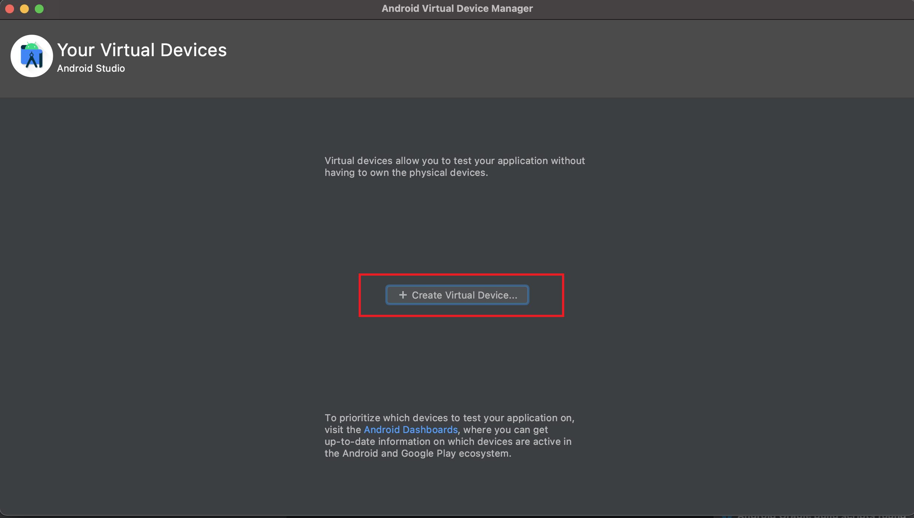
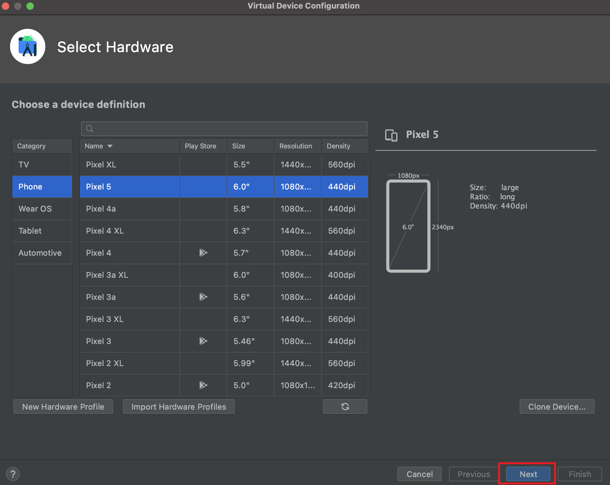
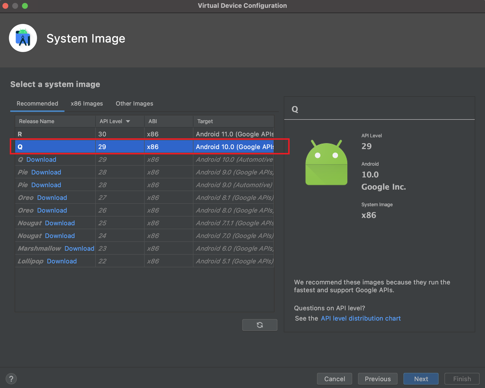
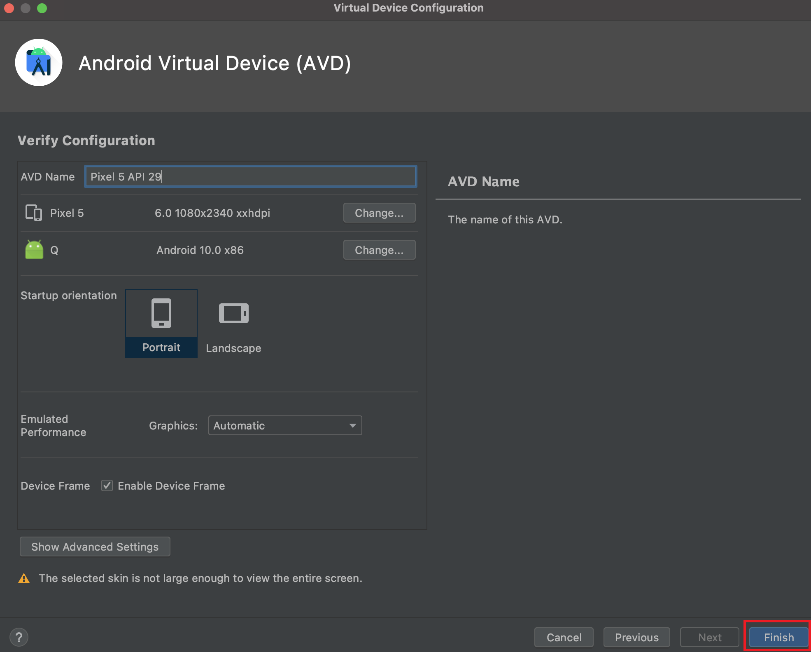
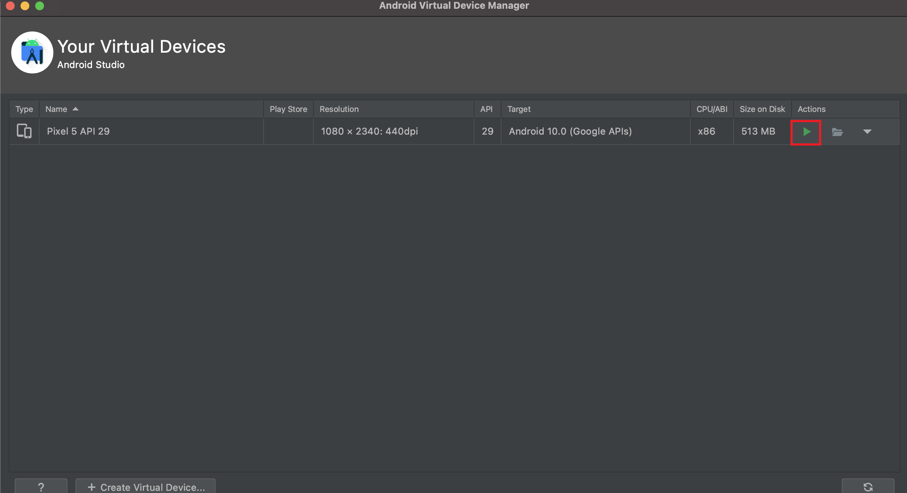
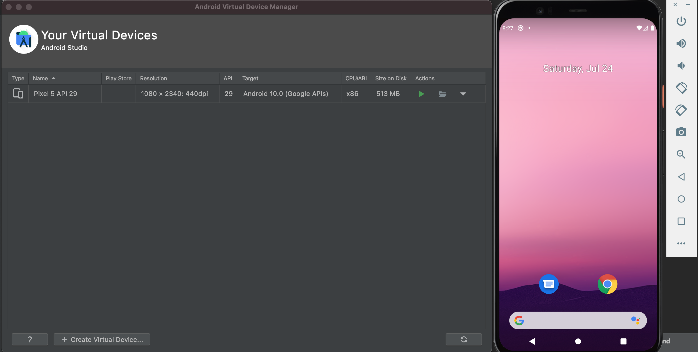
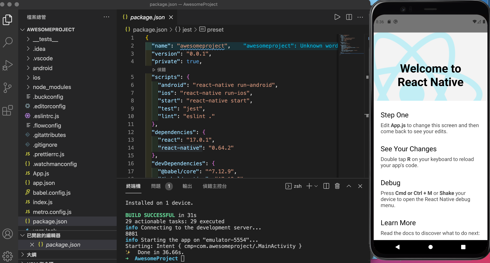
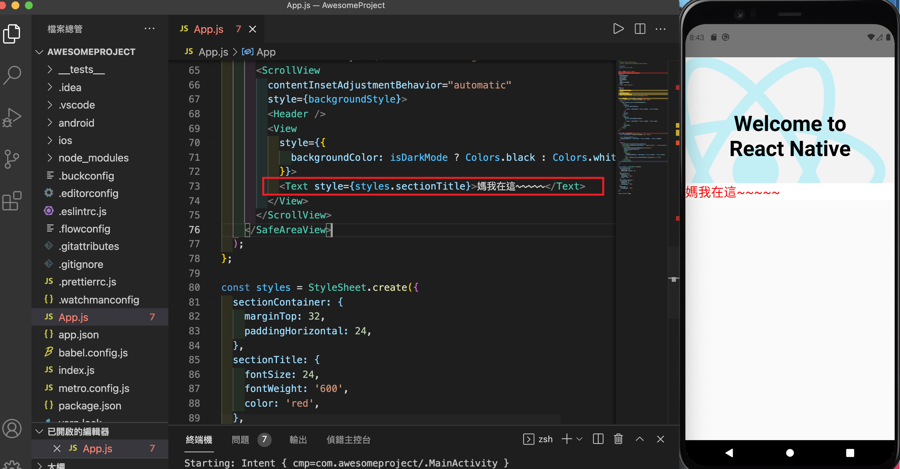

這系列文章將一步步介紹如何在 mac 上搭建 Android 和 ios 的開發環境(React Native ClI)、如何在模擬器和實體裝置中運行、如何打包 APK 和 IPA。

會選擇 React Native ClI 而不是較友善的 Expo ClL 是因為筆者之後想要在 RN 上用 WebRTC，考慮到支援度的問題，所以選擇 React Native ClI。

而這篇將介紹如何在<b>模擬器(Android Studio)和實體裝置中運行你的 RN 專案！</b>在閱讀這篇文章之前，請先確實按照上一篇 [React Native 開發環境建置 - Android 篇(上)](https://yachen168.github.io/article/rn-environment-android.html#more) 的步驟進行相關的 Android 開發環境設定。

<!-- more -->

<br/>

# Hello World!
現在可以開始建立 RN 專案了！

> ❗️❗️注意: 如果你之前有在全域安裝過 `react-native-cli`，記得要先 `npm uninstall -g react-native-cli`，否則可能會出現一些無法預期的問題。

<br/>

建立一個名叫 AwesomeProject 的 RN 專案:
```shell
npx react-native init AwesomeProject
```

或是建立 Typescript 的 template:
```shell
npx react-native init AwesomeTSProject --template react-native-template-typescript
```

建立 RN 專案後，可以透過兩種方式查看 android 的運行結果:
- 模擬器 - Android Studio
- 實體裝置 (需要 USB 連接電腦和手機)

<br/>

# 在模擬器(Android Studio)上運行
使用 `Android Studio` 打開剛剛建立好的 AwesomeProject，然後打開 AVD Manager (AVD Manager 的 icon: 

如果你是剛安裝好 Android Studio，你需要先[建立 AVD (Android Virtual Device)](https://developer.android.com/studio/run/managing-avds): 點擊 `Create Virtual Device`



選擇你要的虛擬裝置，然後按 `Next`:



選擇 `Q API Level 29 image`，然後按 `Next`:



再按 `Finish`:



新增完 AVD 後，就可以按<b>綠色三角形</b>的按鈕來啟動:






在 VSCode 中打開 RN 專案，並在專案下執行 `yarn android`:
```shell
yarn android
```

就可以看到 RN 專案運行在 Android Studio 上了:



可以在 `App.js` 修改幾行程式碼看效果(記得按 command + s 儲存變更):




<br/>

# USB 連接實體裝置
很多時候會需要連接實體裝置來運行，例如當你的專案需要使用到手機的 camera 時，就會需要使用真的實體機來看效果。

要在實體手機上運行，需要以下步驟:

1. 在實體手機上點選 `設定` → `關於手機` → `軟體資訊`，找到轉體資訊中的`版本號碼`，連續點擊`版本號碼` `7 下`，<b>手機就會啟動開發者模式</b>。
   
2. 回到手機上的 `設定` 畫面，會看到多出一個 `開發人員選項`，點擊進入開發人員選項。
   
3. 在開發人員選項中，找到 `USB 偵錯` 並`開啟`。
   
4. 用 <b>USB 連接電腦和手機裝置</b>，然後在 RN 專案下執行 `adb devices`，查看裝置有無連接成功:
   ```shell
   $ adb devices

    List of devices attached
    14ed2fcc device         # 實體裝置
   ```
   > ❗️❗️注意: 一次只能連接一個裝置(包含 Android Studio)，也就是需要確保 `adb devices` 回傳的 List of devices attached 中`只有 1 個`是連線狀態，否則後續操作可能會失敗。<b>如果你要使用實體裝置，就斷開 Android Studio; 要使用 Android Studio，就斷開實體裝置!</b>

5. 執行 `yarn android`，就可以看到它在實體裝置上運行了:
    ```shell
    yarn android
    ```

結束後記得關閉實體手機的開發者模式: 設定 → 開發者模式 → 關閉

<br/>

# 結語
...筆者身為一個 Web 開發者，覺得 App 的開發者也太有耐性了吧! 🤔

<br/>
<br/>

<b>參考資源</b>
1. [RN Docs - Setting up the development environment
](https://reactnative.dev/docs/environment-setup)
2. [RN Docs - Running On Device
](https://reactnative.dev/docs/running-on-device)
